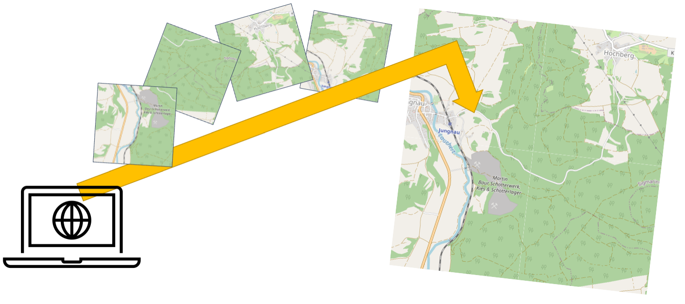

# TileStitcher

**A High-Resolution Map-Image-Generator**


### What ?

You define a Coordinate-Bounding box, ***TileStitcher*** **downloads** and merges the **tile-images**. This will give you a **high-resolution image** from your map-section.

It supports multiple tiling schemes - even your own tile server if desired.


### Why?

Want to print a map-segment for a giant poster? Awesome - this will meet your needs. 


### Improvements?

Bugs, ideas, improvements -let me now and we'll figure it out somehow. 


### This is great - thanks!

You're welcome :) 

# How to use

### Install

Just use:

```
pip install map_tile_stitcher
```

It's as simple as that.


### Use

**Quick Start**

```python
from map_tile_stitcher.util.data_structures import Coordinate
from map_tile_stitcher.util.quick_start import QuickMapStitcher


# define your requesting area and resolution

start  = Coordinate(48.139974, 9.20929)  # lat, lon
end    = Coordinate(48.111443, 9.271603) # lat, lon
zoom   = 16  # from range 1..18, where 1 is course and 18 is very high-detail


# create Stitcher and start 

stitcher = QuickMapStitcher()
stitcher.download_and_stitch(start, end, zoom)
```


**More advanced**

Alternatively you can exactly specify the tile-cells you want to download as well as the download- and merging-options:

```python
from map_tile_stitcher.util.data_structures import Coordinate
from map_tile_stitcher.util.quick_start import QuickMapStitcher


# define your requesting area and resolution
start  = Coordinate(48.139974, 9.20929)  # lat, lon
end    = Coordinate(48.111443, 9.271603) # lat, lon
zoom   = 16  # from range 1..18, where 1 is course and 18 is very high-detail


# convert lon-lat coordinates to grid-cell indices
start_grid_index = conversion.get_index_from_coordinate(start, zoom)
end_grid_index   = conversion.get_index_from_coordinate(end, zoom)


# set up request bounding box
grid_bb = GridBoundingBox(start_grid_index, end_grid_index)


# download images
downloader = TileDownloader()  # you can configure the downloader here
downloader.download_tiles(grid_bb)

# merge image
merger = TileMerger() # you can configure the merger here
merger.merge(grid_bb)
```


As an example, you can change the Tiling style:

```python
# .. 
from map_tile_stitcher.definitions import DEFAULT_TILE_SERVERS
#..

# choose style / tiling server
tile_style = DEFAULT_TILE_SERVERS["STAMEN_TONER"]  # black/white styled tiling 

# download images
downloader = TileDownloader(tile_servers=tile_style)
downloader.download_tiles(grid_bb)

# merge image
merger = TileMerger()
merger.merge(grid_bb)

```

